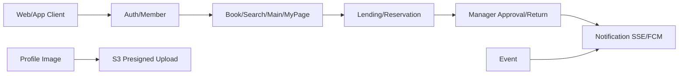

# BookMaru API 명세서

작성 기준일: 2026-05-02

이 문서는 현재 코드의 `presentation adapter`, request DTO, result DTO, exception/error code를 기준으로 정리한 API 명세입니다. JSON 필드는 `application.yml`의 `spring.jackson.property-naming-strategy: SNAKE_CASE` 기준으로 표기합니다.

## 서비스 방향성

BookMaru는 소속 도서관 또는 학교 단위로 책을 조회하고, 대여 요청, 예약, 반납, 이벤트, 알림을 관리하는 서비스입니다.



핵심 흐름은 다음과 같습니다.

- 사용자는 회원가입/로그인 후 JWT를 받아 서비스 API를 호출합니다.
- 책 목록, 검색, 상세, 댓글, 좋아요, 랭킹, 마이페이지를 조회합니다.
- 사용자는 책 대여 요청 또는 예약을 수행합니다.
- 관리자는 대여 요청을 SSE로 실시간 확인하고 승인하거나, 대여 중인 책을 반납 처리합니다.
- 대여 승인, 예약 자동 대여, 이벤트 생성, 연체 발생은 내부 알림과 FCM 알림으로 전송됩니다.
- 프로필 이미지는 서버가 presigned URL을 발급하고, 클라이언트가 S3에 직접 업로드한 뒤 `image_key`를 회원 정보에 저장합니다.

## 현재 API 정상 동작 점검

코드 기준으로 확인한 결과, 기능 목적과 API 흐름은 대부분 맞지만 아래 항목은 운영 전에 확인 또는 수정이 필요합니다.

| 구분 | 상태 | 내용 |
| --- | --- | --- |
| 일반 인증 API 보안 매칭 | 수정 필요 | `SecurityConfig`에 `/main`, `/book`, `/search`, `/myPage`, `/ranking`, `/api/{bookAffiliationId}`, `/api/comment`, `/api/bookDetail`, `/api/notification`에 대한 `authenticated` 또는 role matcher가 보이지 않습니다. 현재 설정만 보면 permitAll/manager/event/officialCode 외 요청이 차단될 수 있습니다. |
| 책 좋아요/댓글 좋아요 URL | 수정 필요 | `BookLikeAdapter`와 `BookCommentLikeAdapter`가 모두 `/api/bookDetail/{id}/like`, `/api/bookDetail/{id}/unlike` 패턴을 사용합니다. 댓글 좋아요는 `/api/comment/{commentId}/like`처럼 분리하는 편이 안전합니다. |
| `GET /api/verification/find-id` | 미구현 | `SecurityConfig`에는 허용 경로가 있지만 실제 adapter endpoint는 없습니다. |
| `GET /api/notification` 응답 포맷 | 확인 필요 | 다른 API는 `SuccessResponse`로 감싸지만 알림 조회는 `SliceResult<Notification>`을 바로 반환합니다. 프론트와 통일 여부를 정해야 합니다. |
| `GET /main/book` 앱 응답 | 확인 필요 | `platformType`을 받지만 현재 WEB/APP 모두 `ViewMainPageWebBookResponseDto` 형태로 반환합니다. 앱에서 이미지만 원한다면 `ViewMainPageAppBookResponseDto`를 사용하도록 수정이 필요합니다. |
| 반납 후 예약자 자동 대여 카운트 | 수정 필요 | `ReturnService.assignReturnedBookToFirstReservation()`에서 예약자의 `reservationCount` 감소 후 `rentalCount`를 증가해야 하는데 현재 `decrementRentalCount()` 호출로 보입니다. |
| Hibernate query timeout 설정 | 확인 필요 | `hibernate.jdbc.timeout`은 Hibernate 6 계열에서 유효하지 않을 수 있습니다. 실제 쿼리 timeout은 `jakarta.persistence.query.timeout` 또는 DB `statement_timeout` 중심으로 봐야 합니다. |

## 공통 규칙

### Auth Header

인증 API를 제외한 대부분의 API는 JWT access token이 필요합니다.

| Name | Type | Required | Description |
| --- | --- | --- | --- |
| Authorization | String | Yes | `Bearer {access_token}` |

### Platform

| Key | Type | Value |
| --- | --- | --- |
| platformType | String | `WEB`, `ANDROID`, `IOS` |

`WEB`은 refresh token을 cookie로 받고, `ANDROID`/`IOS`는 response body에서 `refresh_token`을 받는 구조입니다.

### Device Token

| Name | Type | Required | Description |
| --- | --- | --- | --- |
| X-Device-Token | String | No | FCM push용 device token. 로그인, reissue 시 등록/갱신되고 logout 시 해당 토큰만 삭제됩니다. |

### Pageable

Spring `Pageable`을 사용하는 API는 query parameter로 받습니다.

| Key | Type | Required | Default |
| --- | --- | --- | --- |
| page | Int | No | `0` |
| size | Int | No | API별 기본값 |

### Success Response

대부분의 API는 아래 구조를 사용합니다.

```json
{
  "status": "OK",
  "message": "요청이 성공했습니다.",
  "data": {}
}
```

### Error Response

전역 예외 응답은 아래 구조입니다.

```json
{
  "code": "MEMBER-003",
  "message": "유저를 찾지 못했습니다.",
  "status": 404,
  "path": "plain.bookmaru.domain.member.exception.NotFoundMemberException..."
}
```

### Common Exception

| Code | HTTP | 발생 상황 |
| --- | --- | --- |
| `AUTH-001` | 401 | JWT 만료 |
| `AUTH-002` | 401 | 지원하지 않는 JWT |
| `AUTH-004` | 401 | 올바르지 않은 JWT |
| `AUTH-005` | 404 | 인증/refresh token 정보를 찾지 못함 |
| `AUTH-009` | 400 | platform 정보 불일치 |
| `ILLEGAL_ARGUMENT_ERROR` | 400 | enum 값 오류, 잘못된 요청 파라미터 |
| `ILLEGAL_STATE_ERROR` | 400 | 객체 상태 오류 |
| `VALID_ERROR` | 400 | Bean validation 실패 |
| `INTERNAL_SERVER_ERROR` | 500 | 처리되지 않은 서버 오류 |

## Auth API

### POST `/api/auth/login`

로그인하고 access token/refresh token을 발급합니다. 앱은 `X-Device-Token`을 같이 보내면 FCM 토큰이 등록됩니다.

#### Request Parameter

| Key | Type | Required | Value |
| --- | --- | --- | --- |
| platformType | String | Yes | `WEB`, `ANDROID`, `IOS` |

#### Request Header

| Name | Type | Required |
| --- | --- | --- |
| X-Device-Token | String | No |

#### Request Body

```json
{
  "username": "heiji",
  "password": "password1234"
}
```

#### Response Cookie

`platformType=WEB`일 때 설정됩니다.

| Name | Value |
| --- | --- |
| refreshToken | JWT refresh token |

#### Success Response

```json
{
  "status": "OK",
  "message": "로그인이 성공했습니다.",
  "data": {
    "username": "heiji",
    "access_token": "eyJhbGciOiJIUzI1NiJ9...",
    "authority": "ROLE_USER",
    "platform_type": "WEB",
    "affiliation_name": "대덕소프트웨어마이스터고등학교",
    "oauth_provider": "DEFAULT",
    "profile_image": "members/252/profile/uuid.webp",
    "refresh_token": null
  }
}
```

앱 응답은 `refresh_token`이 body에 포함됩니다.

#### Exception Response

| Code | HTTP | 발생 상황 |
| --- | --- | --- |
| `MEMBER-003` | 404 | 유저 정보 없음 |
| `AUTH-003` | 400 | 비밀번호 불일치 |
| `AFFILIATION-001` | 404 | 소속 정보 없음 |
| `ILLEGAL_ARGUMENT_ERROR` | 400 | platformType 값 오류 |

### PUT `/api/auth/reissue`

refresh token으로 access token/refresh token을 재발급합니다. 앱은 `X-Device-Token`을 보내면 해당 기기 토큰을 등록/갱신합니다.

#### Request Parameter

| Key | Type | Required | Value |
| --- | --- | --- | --- |
| platformType | String | Yes | `WEB`, `ANDROID`, `IOS` |

#### Request Header

| Name | Type | Required |
| --- | --- | --- |
| X-Refresh-Token | String | Yes |
| X-Device-Token | String | No |

#### Request Body

없음

#### Success Response

로그인 응답과 동일한 token response를 반환합니다.

#### Exception Response

| Code | HTTP | 발생 상황 |
| --- | --- | --- |
| `AUTH-005` | 404 | refresh token 세션 없음 |
| `MEMBER-003` | 404 | 유저 정보 없음 |
| `AFFILIATION-001` | 404 | 소속 정보 없음 |
| `ILLEGAL_ARGUMENT_ERROR` | 400 | platformType 값 오류 |

### POST `/api/auth/logout`

현재 access token을 blacklist 처리하고 refresh token/device token을 정리합니다.

#### Request Parameter

| Key | Type | Required | Value |
| --- | --- | --- | --- |
| platformType | String | Yes | `WEB`, `ANDROID`, `IOS` |

#### Request Header

| Name | Type | Required |
| --- | --- | --- |
| Authorization | String | Yes |
| X-Device-Token | String | No |

#### Request Body

없음

#### Success Response

```json
{
  "status": "NO_CONTENT",
  "message": "로그아웃이 성공했습니다.",
  "data": ""
}
```

#### Exception Response

공통 인증 오류가 발생할 수 있습니다.

## Member API

### POST `/api/member/signup-member`

일반 사용자를 회원가입합니다. 이메일 인증이 완료되어 있어야 합니다.

#### Request Parameter

| Key | Type | Required | Value |
| --- | --- | --- | --- |
| platformType | String | Yes | `WEB`, `ANDROID`, `IOS` |

#### Request Body

```json
{
  "username": "heiji",
  "password": "password1234",
  "email": "heiji@example.com",
  "affiliation_name": "대덕소프트웨어마이스터고등학교"
}
```

#### Success Response

```json
{
  "status": "CREATED",
  "message": "유저 회원가입이 성공적으로 완료됐습니다.",
  "data": {
    "username": "heiji",
    "access_token": "eyJhbGciOiJIUzI1NiJ9...",
    "authority": "ROLE_USER",
    "platform_type": "WEB",
    "affiliation_name": "대덕소프트웨어마이스터고등학교",
    "oauth_provider": "DEFAULT",
    "profile_image": "null",
    "refresh_token": null
  }
}
```

#### Exception Response

| Code | HTTP | 발생 상황 |
| --- | --- | --- |
| `MEMBER-001` | 409 | 이미 존재하는 username |
| `MEMBER-002` | 409 | 이미 사용 중인 email |
| `VERIFICATION-001` | 404 | 이메일 인증 정보 없음 |
| `AFFILIATION-001` | 404 | 소속 정보 없음 |
| `ILLEGAL_ARGUMENT_ERROR` | 400 | platformType 값 오류 |

### POST `/api/member/signup-official`

관리자/사서/교사 등 공식 계정을 회원가입합니다.

#### Request Parameter

| Key | Type | Required | Value |
| --- | --- | --- | --- |
| platformType | String | Yes | `WEB`, `ANDROID`, `IOS` |

#### Request Body

```json
{
  "username": "manager1",
  "password": "password1234",
  "email": "manager@example.com",
  "affiliation_name": "대덕소프트웨어마이스터고등학교",
  "verification_code": "123456"
}
```

#### Success Response

일반 회원가입과 동일한 token response를 반환하며 `authority`는 official code의 role을 따릅니다.

#### Exception Response

| Code | HTTP | 발생 상황 |
| --- | --- | --- |
| `VERIFICATION-003` | 400 | 관리자 인증 코드 불일치 |
| `MEMBER-001` | 409 | 이미 존재하는 username |
| `MEMBER-002` | 409 | 이미 사용 중인 email |
| `VERIFICATION-001` | 404 | 이메일 인증 정보 없음 |
| `AFFILIATION-001` | 404 | 소속 정보 없음 |

### POST `/api/member/signup-social`

OAuth 가입 중 추가 정보가 필요한 사용자가 소속을 선택해 회원가입을 완료합니다.

#### Request Parameter

| Key | Type | Required | Value |
| --- | --- | --- | --- |
| platformType | String | Yes | `WEB`, `ANDROID`, `IOS` |

#### Request Body

```json
{
  "affiliation_name": "대덕소프트웨어마이스터고등학교",
  "register_token": "oauth-register-session-token"
}
```

#### Success Response

token response를 반환합니다.

#### Exception Response

| Code | HTTP | 발생 상황 |
| --- | --- | --- |
| `AUTH-007` | 404 | OAuth 가입 세션 만료 또는 없음 |
| `AUTH-009` | 400 | platform 정보 불일치 |
| `AFFILIATION-001` | 404 | 소속 정보 없음 |

### PATCH `/api/member/password-change`

비밀번호를 변경합니다. 일반 로그인 계정만 변경할 수 있습니다.

#### Request Header

| Name | Type | Required |
| --- | --- | --- |
| Authorization | String | Yes |

#### Request Body

```json
{
  "new_password": "newPassword1234",
  "existing_password": "oldPassword1234"
}
```

#### Success Response

```json
{
  "status": "OK",
  "message": "비밀번호 변경이 성공했습니다. 새로 로그인 해주세요.",
  "data": ""
}
```

#### Exception Response

| Code | HTTP | 발생 상황 |
| --- | --- | --- |
| `MEMBER-003` | 404 | 유저 정보 없음 |
| `MEMBER-004` | 400 | 기존 비밀번호 재사용 |
| `MEMBER-005` | 400 | 기존 비밀번호 불일치 또는 OAuth 계정 |

### PATCH `/api/member/often-read-book-time`

자주 책을 읽는 시간을 저장합니다.

#### Request Body

```json
{
  "time": "21:30:00"
}
```

#### Success Response

```json
{
  "status": "OK",
  "message": "자주 책 보는 시간이 등록됐습니다.",
  "data": ""
}
```

#### Exception Response

| Code | HTTP | 발생 상황 |
| --- | --- | --- |
| `MEMBER-003` | 404 | 유저 정보 없음 |
| `ILLEGAL_ARGUMENT_ERROR` | 400 | `time` 형식 오류 |

### DELETE `/api/member/delete`

회원 정보를 soft delete 처리합니다.

#### Request Header

| Name | Type | Required |
| --- | --- | --- |
| Authorization | String | Yes |

#### Success Response

```json
{
  "status": "NO_CONTENT",
  "message": "유저 정보 삭제가 성공했습니다.",
  "data": ""
}
```

#### Exception Response

| Code | HTTP | 발생 상황 |
| --- | --- | --- |
| `MEMBER-003` | 404 | 유저 정보 없음 |
| `AUTH-001` | 401 | 토큰 만료 |
| `AUTH-004` | 401 | 잘못된 토큰 |

### PATCH `/api/member/affiliation-change`

회원의 소속을 변경하고 새로운 토큰을 발급합니다.

#### Request Parameter

| Key | Type | Required | Value |
| --- | --- | --- | --- |
| platformType | String | Yes | `WEB`, `ANDROID`, `IOS` |

#### Request Body

```json
{
  "new_affiliation_name": "새 소속 도서관"
}
```

#### Success Response

token response를 반환합니다.

#### Exception Response

| Code | HTTP | 발생 상황 |
| --- | --- | --- |
| `MEMBER-003` | 404 | 유저 정보 없음 |
| `AFFILIATION-001` | 404 | 소속 정보 없음 |
| `AFFILIATION-002` | 409 | 기존 소속과 동일 |

### PATCH `/api/member/nickname-change`

닉네임을 변경합니다.

#### Request Body

```json
{
  "new_nickname": "새닉네임"
}
```

#### Success Response

```json
{
  "status": "OK",
  "message": "유저 닉네임 변경이 성공했습니다.",
  "data": ""
}
```

#### Exception Response

| Code | HTTP | 발생 상황 |
| --- | --- | --- |
| `MEMBER-003` | 404 | 유저 정보 없음 |
| `MEMBER-006` | 409 | 이미 사용 중인 닉네임 |

### POST `/api/member/profile-image/url`

프로필 이미지 업로드용 S3 presigned URL을 발급합니다.

#### Request Body

```json
{
  "file_name": "profile.webp",
  "content_type": "image/webp",
  "file_size": 1048576
}
```

#### Success Response

```json
{
  "status": "OK",
  "message": "프로필 이미지 업로드 URL을 발급했습니다.",
  "data": {
    "upload_url": "https://bookmaru-profile-images.s3.ap-northeast-2.amazonaws.com/...",
    "image_key": "members/252/profile/uuid.webp",
    "public_url": "https://bookmaru-profile-images.s3.ap-northeast-2.amazonaws.com/members/252/profile/uuid.webp",
    "expires_at": "2026-05-02T09:00:00Z"
  }
}
```

#### Exception Response

| Code | HTTP | 발생 상황 |
| --- | --- | --- |
| `MEMBER-003` | 404 | 유저 정보 없음 |
| `ILLEGAL_ARGUMENT_ERROR` | 400 | 파일 크기 1 byte 미만/3MB 초과, 확장자 또는 MIME type 불일치 |

허용 형식은 `jpg`, `jpeg`, `png`, `webp`이며 MIME type은 `image/jpeg`, `image/png`, `image/webp`입니다.

### PATCH `/api/member/profileImage-change`

S3 업로드가 끝난 프로필 이미지 object key를 회원 정보에 저장합니다.

#### Request Body

```json
{
  "image_key": "members/252/profile/uuid.webp"
}
```

#### Success Response

```json
{
  "status": "OK",
  "message": "프로필 정보 수정이 성공했습니다.",
  "data": ""
}
```

#### Exception Response

| Code | HTTP | 발생 상황 |
| --- | --- | --- |
| `MEMBER-003` | 404 | 유저 정보 없음 |
| `ILLEGAL_ARGUMENT_ERROR` | 400 | `members/{memberId}/profile/` prefix 불일치 또는 허용하지 않는 확장자 |

### GET `/api/member/valid-nickname`

닉네임 사용 가능 여부를 조회합니다.

#### Request Parameter

| Key | Type | Required |
| --- | --- | --- |
| nickname | String | Yes |

#### Success Response

```json
{
  "status": "OK",
  "message": "닉네임 검증에 성공했습니다.",
  "data": true
}
```

## Verification API

### POST `/api/verification/email/send`

이메일 인증 코드를 발송합니다.

#### Request Parameter

| Key | Type | Required | Value |
| --- | --- | --- | --- |
| codeType | String | Yes | `VERIFICATION_EMAIL`, `FIND_PASSWORD` |

#### Request Body

```json
{
  "email": "heiji@example.com"
}
```

#### Success Response

```json
{
  "status": "OK",
  "message": "메시지가 정상적으로 전송되었습니다.",
  "data": ""
}
```

#### Exception Response

| Code | HTTP | 발생 상황 |
| --- | --- | --- |
| `ILLEGAL_ARGUMENT_ERROR` | 400 | codeType 값 오류 |
| `INTERNAL_SERVER_ERROR` | 500 | SMTP 전송 실패 |

### POST `/api/verification/email/verify`

이메일 인증 코드를 검증합니다.

#### Request Body

```json
{
  "email": "heiji@example.com",
  "verification_code": "123456"
}
```

#### Success Response

```json
{
  "status": "CREATED",
  "message": "이메일 인증이 성공적으로 완료되었습니다.",
  "data": ""
}
```

#### Exception Response

| Code | HTTP | 발생 상황 |
| --- | --- | --- |
| `VERIFICATION-001` | 404 | 이메일 인증 정보 없음 |
| `VERIFICATION-002` | 400 | 인증 코드 불일치 |

### POST `/api/verification/officialCode/save`

관리자 가입용 official code를 생성합니다. `ROLE_ADMIN`만 호출할 수 있습니다.

#### Request Parameter

| Key | Type | Required |
| --- | --- | --- |
| affiliationName | String | Yes |

#### Request Body

없음

#### Success Response

```json
{
  "status": "CREATED",
  "message": "관리자 회원가입 인증 코드 생성이 성공했습니다.",
  "data": ""
}
```

#### Exception Response

| Code | HTTP | 발생 상황 |
| --- | --- | --- |
| `AFFILIATION-001` | 404 | 소속 정보 없음 |
| `403` | 403 | ADMIN 권한 없음 |

### POST `/api/verification/find-password`

비밀번호 재설정 인증 코드를 검증하고 register token을 발급합니다.

#### Request Body

```json
{
  "email": "heiji@example.com",
  "verification_code": "123456"
}
```

#### Success Response

```json
{
  "status": "OK",
  "message": "비밀번호 정보를 수정할 수 있습니다.",
  "data": true
}
```

#### Exception Response

| Code | HTTP | 발생 상황 |
| --- | --- | --- |
| `MEMBER-003` | 404 | 유저 정보 없음 |
| `VERIFICATION-001` | 404 | 인증 코드 정보 없음 |
| `VERIFICATION-002` | 400 | 인증 코드 불일치 |

### PATCH `/api/verification/password-reset`

비밀번호를 재설정합니다.

#### Request Parameter

| Key | Type | Required |
| --- | --- | --- |
| registerToken | String | Yes |

#### Request Body

```json
{
  "email": "heiji@example.com",
  "new_password": "newPassword1234"
}
```

#### Success Response

```json
{
  "status": "OK",
  "message": "비밀번호 수정이 성공적으로 완료되었습니다.",
  "data": ""
}
```

#### Exception Response

| Code | HTTP | 발생 상황 |
| --- | --- | --- |
| `MEMBER-003` | 404 | 유저 정보 없음 |
| `MEMBER-004` | 400 | 기존 비밀번호 재사용 |
| `VERIFICATION-002` | 400 | register token 불일치 또는 만료 |

## Affiliation API

### GET `/affiliation/view`

가입 또는 소속 변경에 사용할 소속 목록을 조회합니다.

#### Request

없음

#### Success Response

```json
{
  "status": "OK",
  "message": "소속 조회가 성공했습니다.",
  "data": {
    "affiliation_view_result": {
      "affiliations": [
        {
          "id": 1,
          "affiliation_name": "대덕소프트웨어마이스터고등학교"
        }
      ]
    }
  }
}
```

## Display API

### GET `/main/event`

메인 페이지 이벤트 목록을 조회합니다.

#### Success Response

```json
{
  "status": "OK",
  "message": "메인 페이지 이벤트 정보를 가져오는데 성공했습니다.",
  "data": {
    "event_info_result_list": [
      {
        "image_url": "https://cdn.example.com/event.png",
        "id": 10
      }
    ]
  }
}
```

### GET `/main/book`

메인 페이지 인기/최신 책 목록을 조회합니다.

#### Request Parameter

| Key | Type | Required | Value |
| --- | --- | --- | --- |
| bookFindType | String | Yes | `POPULAR`, `RECENT` |
| platformType | String | Yes | `WEB`, `ANDROID`, `IOS` |

#### Success Response

```json
{
  "status": "OK",
  "message": "인기 책 조회가 성공했습니다.",
  "data": [
    {
      "id": 1,
      "book_image": "https://cdn.example.com/book.png",
      "title": "책 제목",
      "author": "작가",
      "genre_list": [
        {
          "genre": "컴퓨터"
        }
      ]
    }
  ]
}
```

#### Exception Response

| Code | HTTP | 발생 상황 |
| --- | --- | --- |
| `ILLEGAL_ARGUMENT_ERROR` | 400 | bookFindType 또는 platformType 값 오류 |

### GET `/book/{bookAffiliationId}`

책 상세 정보를 조회합니다.

#### Request Parameter

| Key | Type | Required | Description |
| --- | --- | --- | --- |
| bookAffiliationId | Long | Yes | Path variable |

#### Success Response

```json
{
  "status": "OK",
  "message": "책 상세 정보를 가져오는데 성공했습니다.",
  "data": {
    "affiliation_name": "대덕소프트웨어마이스터고등학교",
    "book_info": {
      "title": "책 제목",
      "author": "작가",
      "publication_date": "2024-01-01",
      "introduction": "책 소개",
      "book_image": "https://cdn.example.com/book.png",
      "publisher": "출판사"
    },
    "is_enable_rental": true,
    "genres": [
      {
        "genre_id": 1,
        "genre": {
          "id": 1,
          "genre_name": "컴퓨터"
        }
      }
    ],
    "is_liked": false
  }
}
```

#### Exception Response

| Code | HTTP | 발생 상황 |
| --- | --- | --- |
| `BOOK-01` | 404 | 책 정보 없음 |

### GET `/book/{bookAffiliationId}/comment`

책 댓글 목록을 조회합니다.

#### Request Parameter

| Key | Type | Required | Default |
| --- | --- | --- | --- |
| bookAffiliationId | Long | Yes | Path variable |
| page | Int | No | 0 |
| size | Int | No | 20 |

#### Success Response

```json
{
  "status": "OK",
  "message": "책 상세정보 댓글을 가져오는데 성공했습니다.",
  "data": {
    "content": [
      {
        "profile_image": "members/252/profile/uuid.webp",
        "comment_id": 1,
        "nickname": "heiji",
        "comment": "좋은 책입니다.",
        "like_count": 3
      }
    ],
    "is_last_page": true
  }
}
```

### GET `/myPage`

마이페이지 요약 정보를 조회합니다.

#### Success Response

```json
{
  "status": "OK",
  "message": "마이페이지 조회가 성공했습니다.",
  "data": {
    "profile_image": "members/252/profile/uuid.webp",
    "username": "heiji",
    "most_little_left_rental_title": "책 제목",
    "most_little_left_rental_date": 2,
    "rented_book_count": 1,
    "reserved_book_count": 1,
    "overdue_book_count": 0
  }
}
```

#### Exception Response

| Code | HTTP | 발생 상황 |
| --- | --- | --- |
| `MEMBER-003` | 404 | 유저 정보 없음 |

### GET `/myPage/lendingInfo`

내 대여/예약/연체 책 목록을 조회합니다.

#### Success Response

```json
{
  "status": "OK",
  "message": "마이페이지 유저 책 관련 정보를 가져오는데 성공했습니다.",
  "data": {
    "rental_book_info": [
      {
        "book_affiliation_id": 1,
        "book_image": "https://cdn.example.com/book.png",
        "title": "책 제목",
        "left_rental_date": 7
      }
    ],
    "reservation_book_info": [
      {
        "book_affiliation_id": 2,
        "book_image": "https://cdn.example.com/book.png",
        "title": "예약 책",
        "rank": 1
      }
    ],
    "over_due_book_info": []
  }
}
```

### GET `/myPage/like-book`

내가 좋아요한 책 목록을 조회합니다.

#### Success Response

```json
{
  "status": "OK",
  "message": "마이페이지 좋아요 누른 책 확인 완료",
  "data": [
    {
      "book_affiliation_id": 1,
      "title": "책 제목",
      "book_image": "https://cdn.example.com/book.png"
    }
  ]
}
```

### GET `/ranking`

소속 내 독서 랭킹을 조회합니다.

#### Success Response

```json
{
  "status": "OK",
  "message": "ranking 데이터를 가져오는데 성공했습니다.",
  "data": [
    {
      "member_id": 252,
      "rank": 1,
      "nick_name": "heiji",
      "one_month_statistics": 12,
      "profile_image": "members/252/profile/uuid.webp",
      "affiliation_name": "대덕소프트웨어마이스터고등학교"
    }
  ]
}
```

## Search API

### GET `/search`

책을 검색합니다. 현재 PostgreSQL full-text search 기반으로 검색합니다.

#### Request Parameter

| Key | Type | Required | Value |
| --- | --- | --- | --- |
| platformType | String | Yes | `WEB`, `ANDROID`, `IOS` |
| keyword | String | Yes | 검색어 |
| page | Int | No | 기본 0 |
| size | Int | No | 기본 12 |

#### Success Response - WEB

```json
{
  "status": "OK",
  "message": "검색하는데 성공했습니다.",
  "data": {
    "content": [
      {
        "book_affiliation_id": 1,
        "title": "책 제목",
        "author": "작가",
        "introduction": "책 소개",
        "publisher": "출판사",
        "publication_date": "2024-01-01",
        "book_image": "https://cdn.example.com/book.png"
      }
    ],
    "is_last_page": true
  }
}
```

#### Success Response - APP

```json
{
  "status": "OK",
  "message": "검색하는데 성공했습니다.",
  "data": {
    "content": [
      {
        "book_affiliation_id": 1,
        "book_image": "https://cdn.example.com/book.png"
      }
    ],
    "is_last_page": true
  }
}
```

#### Exception Response

| Code | HTTP | 발생 상황 |
| --- | --- | --- |
| `ILLEGAL_ARGUMENT_ERROR` | 400 | platformType 값 오류 |

## Lending API

### POST `/api/{bookAffiliationId}/rental`

책 대여 요청을 생성합니다. 예약자가 있는 책은 첫 번째 예약자만 대여 요청할 수 있습니다.

#### Request Parameter

| Key | Type | Required | Description |
| --- | --- | --- | --- |
| bookAffiliationId | Long | Yes | Path variable |

#### Request Body

없음

#### Success Response

```json
{
  "status": "OK",
  "message": "책 대여에 성공했습니다.",
  "data": ""
}
```

#### Exception Response

| Code | HTTP | 발생 상황 |
| --- | --- | --- |
| `MEMBER-003` | 404 | 유저 정보 없음 |
| `LENDING-001` | 404 | 대여 가능한 책 상세 없음 |
| `LENDING-002` | 409 | 대여 가능 권수 초과 |
| `LENDING-004` | 400 | 연체 상태 |
| `LENDING-006` | 409 | 첫 번째 예약자가 아님 |

### POST `/api/{bookAffiliationId}/reservation`

책을 예약합니다.

#### Request Parameter

| Key | Type | Required |
| --- | --- | --- |
| bookAffiliationId | Long | Yes |

#### Request Body

없음

#### Success Response

```json
{
  "status": "OK",
  "message": "책 예약이 성공했습니다.",
  "data": ""
}
```

#### Exception Response

| Code | HTTP | 발생 상황 |
| --- | --- | --- |
| `MEMBER-003` | 404 | 유저 정보 없음 |
| `LENDING-003` | 409 | 예약 가능 권수 초과 |
| `LENDING-004` | 400 | 연체 상태 |

### DELETE `/api/{bookAffiliationId}/reservation-delete`

본인의 예약을 취소합니다.

#### Request Parameter

| Key | Type | Required |
| --- | --- | --- |
| bookAffiliationId | Long | Yes |

#### Request Body

없음

#### Success Response

```json
{
  "status": "OK",
  "message": "예약 취소가 성공했습니다.",
  "data": ""
}
```

#### Exception Response

| Code | HTTP | 발생 상황 |
| --- | --- | --- |
| `MEMBER-003` | 404 | 유저 정보 없음 |
| `LENDING-007` | 404 | 취소할 예약 정보 없음 |

## Manager API

### GET `/manager/rentalRequestCheck`

관리자가 대여 요청 목록을 SSE로 구독합니다.

#### Request Header

| Name | Type | Required | Description |
| --- | --- | --- | --- |
| Authorization | String | Yes | 관리자/사서/관리자 권한 |
| Last-Event-ID | String | No | 재연결 시 마지막으로 받은 SSE event id |

#### Response

`Content-Type: text/event-stream`

초기 연결 이벤트:

```text
event: sse-connect
data: {"status":"connected","connected_at":"2026-05-02T18:00:00"}
```

현재 스냅샷:

```text
event: rental-request-snapshot
data: {
  "requests": [
    {
      "book_detail_id": 1,
      "member_id": 252,
      "nick_name": "heiji",
      "title": "책 제목",
      "call_number": "005.1"
    }
  ]
}
```

변경 이벤트:

```text
event: rental-request-update
data: {
  "requests": []
}
```

#### Exception Response

| Code | HTTP | 발생 상황 |
| --- | --- | --- |
| `403` | 403 | `ROLE_MANAGER`, `ROLE_LIBRARIAN`, `ROLE_ADMIN` 권한 없음 |

### GET `/manager/rentalStatusCheck`

관리자가 현재 대여 중인 책 상태를 조회합니다.

#### Request Parameter

| Key | Type | Required | Default |
| --- | --- | --- | --- |
| page | Int | No | 0 |
| size | Int | No | 8 |

#### Success Response

```json
{
  "status": "OK",
  "message": "대여 중인 책 상태 정보를 가져오는데 성공했습니다.",
  "data": {
    "content": [
      {
        "member_id": 252,
        "book_detail_id": 1,
        "title": "책 제목",
        "publisher": "출판사",
        "nickname": "heiji",
        "call_number": "005.1",
        "return_date": "2026-05-16",
        "is_overdue": false
      }
    ],
    "is_last_page": true
  }
}
```

### GET `/manager/rentalStatusCheck/searchMember`

닉네임으로 대여 중인 책 상태를 검색합니다.

#### Request Parameter

| Key | Type | Required | Default |
| --- | --- | --- | --- |
| nickname | String | Yes | - |
| page | Int | No | 0 |
| size | Int | No | 8 |

#### Success Response

`/manager/rentalStatusCheck`와 동일합니다.

### PATCH `/api/manager/approve/{bookDetailId}`

관리자가 사용자의 대여 요청을 승인합니다. 승인되면 해당 유저에게 `RENTAL` 알림이 발송됩니다.

#### Request Parameter

| Key | Type | Required |
| --- | --- | --- |
| bookDetailId | Long | Yes |

#### Request Body

없음

#### Success Response

```json
{
  "status": "OK",
  "message": "대여 요청 승인이 성공했습니다.",
  "data": ""
}
```

#### Exception Response

| Code | HTTP | 발생 상황 |
| --- | --- | --- |
| `LENDING-005` | 404 | 대여 요청 기록 없음 |
| `INVENTORY-001` | 404 | 승인 가능한 책 상세 없음 |
| `403` | 403 | 관리자 권한 없음 |

### PATCH `/api/manager/returnBook/{bookDetailId}`

책 반납을 처리합니다. 예약자가 있으면 첫 번째 예약자에게 즉시 자동 대여되고 `RESERVATION` 알림이 발송됩니다.

#### Request Parameter

| Key | Type | Required |
| --- | --- | --- |
| bookDetailId | Long | Yes |

#### Request Body

없음

#### Success Response

```json
{
  "status": "OK",
  "message": "책 반납 완료",
  "data": ""
}
```

#### Exception Response

| Code | HTTP | 발생 상황 |
| --- | --- | --- |
| `INVENTORY-001` | 404 | 대여 중인 책 상세 없음 |
| `403` | 403 | 관리자 권한 없음 |

## Community API

### POST `/api/comment/{bookAffiliationId}/write`

책 댓글을 작성합니다.

#### Request Parameter

| Key | Type | Required |
| --- | --- | --- |
| bookAffiliationId | Long | Yes |

#### Request Body

```json
{
  "comment": "좋은 책입니다."
}
```

#### Success Response

```json
{
  "status": "CREATED",
  "message": "댓글 작성이 성공했습니다.",
  "data": ""
}
```

### PATCH `/api/comment/{commentId}/change`

내 댓글을 수정합니다.

#### Request Parameter

| Key | Type | Required |
| --- | --- | --- |
| commentId | Long | Yes |

#### Request Body

```json
{
  "comment": "수정된 댓글입니다."
}
```

#### Exception Response

| Code | HTTP | 발생 상황 |
| --- | --- | --- |
| `COMMUNITY-001` | 404 | 댓글 없음 |
| `COMMUNITY-002` | 404 | 작성자가 아닌 사용자가 수정 시도 |

### DELETE `/api/comment/{commentId}/delete`

내 댓글을 삭제합니다.

#### Request Parameter

| Key | Type | Required |
| --- | --- | --- |
| commentId | Long | Yes |

#### Exception Response

| Code | HTTP | 발생 상황 |
| --- | --- | --- |
| `COMMUNITY-001` | 404 | 댓글 없음 |
| `COMMUNITY-002` | 404 | 작성자가 아닌 사용자가 삭제 시도 |

### POST `/api/bookDetail/{bookAffiliationId}/like`

책 좋아요를 누릅니다.

#### Success Response

```json
{
  "status": "NO_CONTENT",
  "message": "책에 좋아요를 누르는데 성공했습니다.",
  "data": ""
}
```

#### Exception Response

| Code | HTTP | 발생 상황 |
| --- | --- | --- |
| `COMMUNITY-003` | 409 | 이미 좋아요를 누름 |

### DELETE `/api/bookDetail/{bookAffiliationId}/unlike`

책 좋아요를 취소합니다.

#### Exception Response

| Code | HTTP | 발생 상황 |
| --- | --- | --- |
| `COMMUNITY-004` | 404 | 취소할 좋아요 없음 |

### POST `/api/bookDetail/{commentId}/like`

댓글 좋아요를 누릅니다.

주의: 현재 책 좋아요 API와 URL 패턴이 동일합니다. 실제 운영 전 `/api/comment/{commentId}/like`로 분리하는 것을 권장합니다.

#### Exception Response

| Code | HTTP | 발생 상황 |
| --- | --- | --- |
| `COMMUNITY-003` | 409 | 이미 좋아요를 누름 |

### DELETE `/api/bookDetail/{commentId}/unlike`

댓글 좋아요를 취소합니다.

주의: 현재 책 좋아요 취소 API와 URL 패턴이 동일합니다. 실제 운영 전 `/api/comment/{commentId}/unlike`로 분리하는 것을 권장합니다.

#### Exception Response

| Code | HTTP | 발생 상황 |
| --- | --- | --- |
| `COMMUNITY-004` | 404 | 취소할 좋아요 없음 |

## Event API

### POST `/api/event/create`

이벤트를 생성합니다. `ROLE_LIBRARIAN`, `ROLE_ADMIN`만 호출할 수 있습니다. 생성 후 같은 소속 사용자에게 `EVENT` 알림이 발송됩니다.

#### Request Body

```json
{
  "title": "독서 이벤트",
  "content": "이벤트 내용",
  "image_url": "https://cdn.example.com/event.png",
  "start_at": "2026-05-10T00:00:00",
  "end_at": "2026-05-20T23:59:59"
}
```

#### Success Response

```json
{
  "status": "CREATED",
  "message": "이벤트 생성이 성공했습니다.",
  "data": ""
}
```

#### Exception Response

| Code | HTTP | 발생 상황 |
| --- | --- | --- |
| `MEMBER-003` | 404 | 생성자 정보 없음 |
| `403` | 403 | 사서/관리자 권한 없음 |
| `ILLEGAL_ARGUMENT_ERROR` | 400 | 날짜 형식 오류 |

### PATCH `/api/event/{eventId}/change`

이벤트를 수정합니다. 생성자 본인만 수정할 수 있습니다.

#### Request Parameter

| Key | Type | Required |
| --- | --- | --- |
| eventId | Long | Yes |

#### Request Body

`/api/event/create`와 동일합니다.

#### Exception Response

| Code | HTTP | 발생 상황 |
| --- | --- | --- |
| `EVENT-002` | 404 | 이벤트 없음 |
| `EVENT_003` | 403 | 생성자가 아닌 사용자가 수정 시도 |

### DELETE `/api/event/{eventId}/delete`

이벤트를 삭제합니다. 생성자 본인만 삭제할 수 있습니다.

#### Exception Response

| Code | HTTP | 발생 상황 |
| --- | --- | --- |
| `EVENT-002` | 404 | 이벤트 없음 |
| `EVENT_003` | 403 | 생성자가 아닌 사용자가 삭제 시도 |

### GET `/event/{eventId}`

이벤트 상세를 조회합니다.

#### Success Response

```json
{
  "status": "OK",
  "message": "이벤트 상세 정보를 가져오는데 성공했습니다.",
  "data": {
    "title": "독서 이벤트",
    "status": "IN_PROGRESS",
    "image_url": "https://cdn.example.com/event.png",
    "start_at": "2026-05-10T00:00:00",
    "end_at": "2026-05-20T23:59:59",
    "content": "이벤트 내용"
  }
}
```

#### Exception Response

| Code | HTTP | 발생 상황 |
| --- | --- | --- |
| `EVENT-002` | 404 | 이벤트 없음 |

## Notification API

### GET `/api/notification`

내 내부 알림 목록을 Slice 형태로 조회합니다.

#### Request Parameter

| Key | Type | Required | Default |
| --- | --- | --- | --- |
| page | Int | No | 0 |
| size | Int | No | 20, 최대 100 |

#### Success Response

주의: 현재 이 API는 `SuccessResponse`로 감싸지 않고 아래 JSON을 바로 반환합니다.

```json
{
  "content": [
    {
      "id": 1,
      "member_id": 252,
      "target_info": {
        "target_id": 10,
        "target_type": "BOOK"
      },
      "notification_info": {
        "name": "대여 요청이 승인되었습니다.",
        "payload": {
          "type": "RENTAL",
          "book_id": 10,
          "title": "책 제목",
          "return_date": "2026-05-16"
        },
        "type": "RENTAL",
        "url": "/book/10"
      },
      "is_read": false
    }
  ],
  "is_last_page": true
}
```

### GET `/api/notification/subscribe`

내 알림을 SSE로 구독합니다.

#### Request Header

| Name | Type | Required |
| --- | --- | --- |
| Authorization | String | Yes |
| Last-Event-ID | String | No |

#### Response

`Content-Type: text/event-stream`

초기 연결:

```text
event: sse-connect
data: {"status":"connected","connected_at":"2026-05-02T18:00:00"}
```

최근 알림 스냅샷:

```text
event: notification-snapshot
data: {
  "notifications": []
}
```

새 알림:

```text
event: notification
data: {
  "notification": {
    "id": 1,
    "member_id": 252,
    "target_info": {
      "target_id": 10,
      "target_type": "BOOK"
    },
    "notification_info": {
      "name": "대여 요청이 승인되었습니다.",
      "payload": {
        "type": "RENTAL",
        "book_id": 10,
        "title": "책 제목",
        "return_date": "2026-05-16"
      },
      "type": "RENTAL",
      "url": "/book/10"
    },
    "is_read": false
  }
}
```

## 알림 발생 조건

| Type | 발생 시점 | Payload |
| --- | --- | --- |
| `RENTAL` | 관리자가 대여 요청 승인 | `RentalPayload(book_id, title, return_date)` |
| `RESERVATION` | 반납된 책이 첫 번째 예약자에게 자동 대여 | `ReservationPayload(book_id, title, return_date)` |
| `EVENT` | 새 이벤트 생성 | `EventPayload(event_id, title, start_date, end_date)` |
| `OVERDUE` | 연체 스케줄러가 연체 상태를 감지 | `OverduePayload(book_id, title, return_date)` |

## Error Code 목록

| Code | HTTP | 의미 |
| --- | --- | --- |
| `AFFILIATION-001` | 404 | 소속 정보를 찾지 못함 |
| `AFFILIATION-002` | 409 | 기존 소속과 동일 |
| `AUTH-001` | 401 | JWT 만료 |
| `AUTH-002` | 401 | 지원하지 않는 JWT |
| `AUTH-003` | 400 | 비밀번호 불일치 |
| `AUTH-004` | 401 | 올바르지 않은 JWT |
| `AUTH-005` | 404 | 인증 정보 없음 |
| `AUTH-006` | 403 | 다른 OAuth 계정과 이미 연결됨 |
| `AUTH-007` | 404 | OAuth 인증 세션 만료 |
| `AUTH-008` | 400 | 지원하지 않는 OAuth |
| `AUTH-009` | 400 | platform 정보 불일치 |
| `BOOK-01` | 404 | 책 정보 없음 |
| `COMMUNITY-001` | 404 | 댓글 없음 |
| `COMMUNITY-002` | 404 | 작성자가 아닌 사용자 접근 |
| `COMMUNITY-003` | 409 | 이미 좋아요 |
| `COMMUNITY-004` | 404 | 취소할 좋아요 없음 |
| `EVENT-001` | 400 | 이벤트 상세 내용 없음 |
| `EVENT-002` | 404 | 이벤트 없음 |
| `EVENT_003` | 403 | 이벤트 생성자가 아닌 사용자 접근 |
| `INVENTORY-001` | 404 | 책 상세 정보 없음 |
| `LENDING-001` | 404 | 대여 가능한 책 없음 |
| `LENDING-002` | 409 | 대여 가능 권수 초과 |
| `LENDING-003` | 409 | 예약 가능 권수 초과 |
| `LENDING-004` | 400 | 연체 상태 |
| `LENDING-005` | 404 | 대여 기록 없음 |
| `LENDING-006` | 409 | 첫 번째 예약자가 아님 |
| `LENDING-007` | 404 | 예약 정보 없음 |
| `MEMBER-001` | 409 | 이미 존재하는 유저 |
| `MEMBER-002` | 409 | 이미 사용 중인 이메일 |
| `MEMBER-003` | 404 | 유저 정보 없음 |
| `MEMBER-004` | 400 | 기존 비밀번호 재사용 |
| `MEMBER-005` | 400 | 기존 비밀번호 불일치 |
| `MEMBER-006` | 409 | 이미 사용 중인 닉네임 |
| `VERIFICATION-001` | 404 | 이메일 인증 정보 없음 |
| `VERIFICATION-002` | 400 | 인증 코드 불일치 |
| `VERIFICATION-003` | 400 | official code 불일치 |

